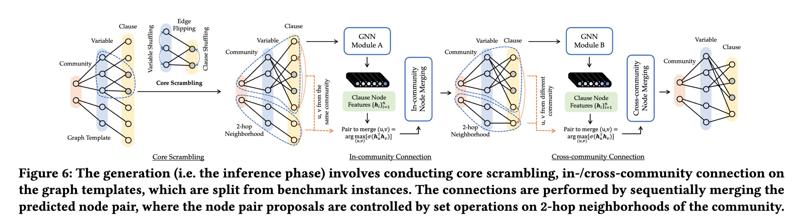

# HardSATGEN: Understanding the Difficulty of Hard SAT Formula Generation and A Strong Structure-Hardness-Aware Baseline

Official implementation of SIGKDD 2023 paper "HardSATGEN: Understanding the Difficulty of Hard SAT Formula Generation and A Strong Structure-Hardness-Aware Baseline".



Industrial SAT formula generation is a critical yet challenging task. Existing SAT generation approaches can hardly simultaneously capture the global structural properties and maintain plausible computational hardness. We first present an in-depth analysis for the limitation of previous learning methods in reproducing the computational hardness of original instances, which may stem from the inherent homogeneity in their adopted split-merge procedure. On top of the observations that industrial formulae exhibit clear community structure and oversplit substructures lead to the difficulty in semantic formation of logical structures, we propose HardSATGEN, which introduces a fine-grained control mechanism to the neural split-merge paradigm for SAT formula generation to better recover the structural and computational properties of the industrial benchmarks. Experiments including evaluations on private and practical corporate testbed show the superiority of HardSATGEN being the only method to successfully augments formulae maintaining similar computational hardness and capturing the global structural properties simultaneously. Compared to the best previous methods, the average performance gains achieve 38.5% in structural statistics, 88.4\% in computational metrics, and over 140.7% in the effectiveness of guiding solver tuning by our generated instances.

---

## Installation

- Basic environment (tested on)
  - python==3.8
  - networkx==3.0
  - pytorch==1.13.1+cu116
  - torch_geometric
  - pygmtools==0.3.5
  - tensorboardX


- Open source tools
  - [cadical](https://github.com/arminbiere/cadical): `./postprocess/cadical`
    - build: `./configure && make`
  - [drat-trim](https://github.com/marijnheule/drat-trim): `./postprocess/drat-trim`
    - build: `make`
  - glucose: See more in "Eval and solver tuning" section.

## Dataset Preparation

example dataset: `${dataset_name}`

- formula：put in `./dataset/${dataset_name}/`, named `${formula_name}.cnf` for each formula
- core：put in `./dataset/${dataset_name}_core/`, named `${formula_name}_core` for each
- lcg_stats.csv：exists in `./dataset/`, add each formula information with format as `${dataset_name}/${formula_name}, ${num_variable}, ${num_clause}`

How to build dataset when only formulas in hand:

1. Prepare core: make sure to build cadical & drat-trim first

    ```bash
    bash scripts/solve_core.sh dataset/${dataset_name}
    ```

    Core files will generated under `dataset/${dataset_name}`, move them into `dataset/${dataset_name}_core`.
    Also, the cadical solving log are stored in dataset/class_name.log, check solving time if needed.

2. Prepare csv

    ```bash
    dataset_name/formula_name, num_var, num_clause
    ```

    The information must be correspounding to original cnf file.
    If a cnf file can't be found in csv, then it will not be use to train/test.
    ** The cnf-lcg converting process may cause "Stats not match", model will automatically skip these cnfs. Since the reason are still not clarified, if encountered this in train/test, we recommend you replace the bad files with some files that didn't cause this problem.

## Run

1. Train

    ```bash
    # Do not remain unsat core
    python src/main_train.py --epoch_num 201 --data_name ${dataset_name} --model GCN # SAGE; GCN
    # remain unsat core && introduce scrambling operation
    python src/main_train.py --epoch_num 201 --data_name ${dataset_name} --core_flag --model GCN # SAGE; GCN
    ```

    After this step, trained models will be saved in `model/` directory.

2. Use to generate Formulas

    ```bash
    python src/main_test.py --epoch_load 200 --data_name ${dataset_name} --model GCN # SAGE; GCN
    # remain unsat core && introduce scrambling operation
    python src/main_test.py --epoch_num 200 --data_name ${dataset_name} --core_flag --model GCN # SAGE; GCN
    ```

    After this step, generated graphs will be saved to `graphs/` directory. 1 graph is generated out of 1 template by default, check `args.py` for more options.

    Graphs will be saved in a single `.dat` file containing all the generated graphs.

    (It may take fairly long time: Running is fast, but updating networkx takes the majority of time in current implementation.)

    We can then generate CNF formulas from the generated graphs

    ```bash
    python src/eval/conversion_lcg.py --src graphs/${dataset_name}_lcg_GCN_coreTrue_alpha.dat --store-dir formulas/${dataset_name} --action=lcg2sat
    ```

3. Post-processing for Formulas

    ```bash
    cd scripts && bash auto_rmcore.sh ${dataset_name} 200 2255
    # ${1}: class name in ./formulas/train_set
    # ${2}: maximum re-post times
    # ${3}: expected solving time threshold in sec
    
    # multi-task version:
    cd scripts && bash auto_rmcore_multi.sh ${dataset_name} 200 2255
    ```

    The post-processed formulas will be stored in `./formulas/${dataset_name}_post`, logs in `./postprocess/cadical/build`


## Eval and Solver Tuning

1. Evaluate graph properties of formulas
    Make sure to build this first: 
    
    ```bash
    g++ -o src/eval/scalefree eval/scalefree.cpp
    ```
    Evaluate generated formulas with:
    ```bash
    # evaluate
    python src/eval/evaluate_graphs_lcg.py -s src/eval/scalefree -d formulas/${dataset_name}/ -o ${dataset_name}.csv
    ```
    
1. Solver tuning
    Here we use [glucose](https://github.com/wadoon/glucose) to test the tuning ability. (following the experiments settings of G2SAT)
    Build glucose first. Download and build it under `./glucose`

    ```bash
    mkdir build
    cd build
    cmake ..
    make
    ```

    Grid-search: change variable decay $v_d$ & clause decay $c_d$ in `glucose/core/Solver.cc`. `opt_var_decay`: {0.75, 0.85, 0.95}. `opt_clause_decay`: {0.7, 0.8, 0.9, 0.999}. There is 3 * 5 = 15 settings. For every settings, run `script/glucose_test.sh` to solve formulas in `glucose/generated`.
    Pick the quickist settings of $v_d, c_d$ as the best tuned parameters.
    Also, change `generated/real` in `glucose-test/run.sh` to test other set.

    Now solve unseen dataset on it, compare the solving time between `real` and `generated` for the tuned parameters.

## Reference

```bibtex
@inproceedings{li2023hardsatgen,
  title={HardSATGEN: Understanding the Difficulty of Hard SAT Formula Generation and A Strong Structure-Hardness-Aware Baseline},
  author={Li, Yang and Chen, Xinyan and Guo, Wenxuan and Li, Xijun and Luo, Wanqian and Huang, Junhua and Zhen, Hui-Ling and Yuan, Mingxuan and Yan, Junchi},
  booktitle={Proceedings of the 29th ACM SIGKDD Conference on Knowledge Discovery and Data Mining},
  year={2023}
}
```

## Acknowledgment

This repository is built upon [G2SAT](https://github.com/JiaxuanYou/G2SAT) and [SAT_generators](https://github.com/i4vk/SAT_generators). 
