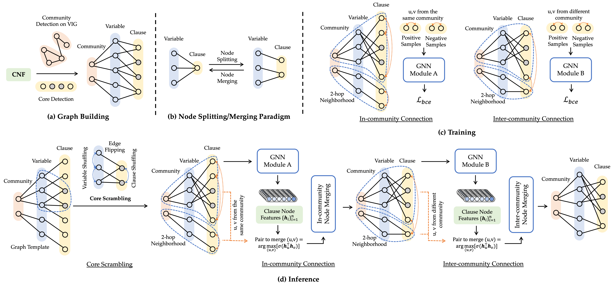

# HardSATGEN: Understanding the Difficulty of Hard SAT Formula Generation and A Strong Structure-Hardness-Aware Baseline

Official implementation of SIGKDD 2023 paper "HardSATGEN: Understanding the Difficulty of Hard SAT Formula Generation and A Strong Structure-Hardness-Aware Baseline".



**Abstract:** Industrial SAT formula generation is a critical yet challenging task. Existing SAT generation approaches can hardly simultaneously capture the global structural properties and maintain plausible computational hardness. We first present an in-depth analysis for the limitation of previous learning methods in reproducing the computational hardness of original instances, which may stem from the inherent homogeneity in their adopted split-merge procedure. On top of the observations that industrial formulae exhibit clear community structure and oversplit substructures lead to the difficulty in semantic formation of logical structures, we propose HardSATGEN, which introduces a fine-grained control mechanism to the neural split-merge paradigm for SAT formula generation to better recover the structural and computational properties of the industrial benchmarks. Experiments including evaluations on private and practical corporate testbed show the superiority of HardSATGEN being the only method to successfully augments formulae maintaining similar computational hardness and capturing the global structural properties simultaneously. Compared to the best previous methods, the average performance gains achieve 38.5% in structural statistics, 88.4\% in computational metrics, and over 140.7% in the effectiveness of guiding solver tuning by our generated instances.

---

## Installation

- Basic environment (tested on)
  - python==3.8
  - pytorch==1.13.0+cu116
  - torch_geometric==2.3
  - networkx==2.8
  - pygmtools==0.3.5
  - protobuf==3.20
  - tensorboardX==2.2
  - matplotlib==3.7.1


- Open source tools
  - [cadical](https://github.com/arminbiere/cadical): clone to `./postprocess/cadical`
    - build: `./configure && make`
    - make dir `log` under `./postprocess/cadical/`
  - [drat-trim](https://github.com/marijnheule/drat-trim): clone to `./postprocess/drat-trim`
    - build: `make`
  - glucose: See more in "Evalution and Solver Tuning" section.

## Dataset Preparation

Example dataset: `${dataset_name}`

- formula: located in `./dataset/${dataset_name}/`,  `${formula_name}.cnf` for each formula
- core: located in `./dataset/${dataset_name}_core/`,  `${formula_name}_core` for each
- `./dataset/lcg_stats.csv`: statistics for the formulae with the format as `${dataset_name}/${formula_name}, ${num_variable}, ${num_clause}`

If needed, you can build your own dataset with collected formulae with the following steps:

1. Prepare core (make sure to build cadical & drat-trim first):

    ```bash
    bash scripts/solve_core.sh dataset/${dataset_name}
    ```

    Core files will generated under `dataset/${dataset_name}`, then move them to `dataset/${dataset_name}_core`. The cadical solving log are stored in `dataset/class_name.log`, check solving time if needed.
    
2. Prepare statistics for the formulae: collect each formula's `dataset_name/formula_name, num_var, num_clause` statistics to form `./dataset/lcg_stats.csv`.


## Run

1. Train models:

    ```bash
    # Do not remain unsat core
    python src/main_train.py --epoch_num 201 --data_name ${dataset_name} --model GCN # SAGE; GCN
    # remain unsat core && introduce scrambling operation
    python src/main_train.py --epoch_num 201 --data_name ${dataset_name} --core_flag --model GCN # SAGE; GCN
    ```

    Trained models will be saved in `model/` directory.

2. Generate formulae:

    ```bash
    python src/main_test.py --epoch_load 200 --data_name ${dataset_name} --model GCN # SAGE; GCN
    # remain unsat core && introduce scrambling operation
    python src/main_test.py --epoch_num 200 --data_name ${dataset_name} --core_flag --model GCN # SAGE; GCN
    ```

    The generated graphs will be saved to `graphs/` directory. We can then generate CNF formulae by converting  the graphs:

    ```bash
python src/eval/conversion_lcg.py --src graphs/${dataset_name}_lcg_GCN_coreTrue_alpha.dat --store-dir formulas/${dataset_name} --action=lcg2sat
    ```

3. Post-processing:

    ```bash
    cd scripts && bash auto_rmcore.sh ${dataset_name} 200 2255
    # ${1}: class name in ./formulas/train_set
    # ${2}: maximum re-post times
    # ${3}: expected solving time threshold in sec
    
    # multi-task version:
    cd scripts && bash auto_rmcore_multi.sh ${dataset_name} 200 2255
    ```

    The post-processed formulae will be stored in `./formulas/${dataset_name}_post`, with logs in `./postprocess/cadical/build`.


## Evalution and Solver Tuning

1. Evaluate graph properties of formulas. 
    
    ```bash
    # preparation
    g++ -o src/eval/scalefree eval/scalefree.cpp
    
    # evaluate
    python src/eval/evaluate_graphs_lcg.py -s src/eval/scalefree -d formulas/${dataset_name}/ -o ${dataset_name}.csv
    ```
    
1. Solver tuning. 
    
    Build [glucose](https://github.com/wadoon/glucose) solver first. Download and build it under `./glucose`.

    ```bash
    mkdir build
    cd build
    cmake ..
    make
    ```

    Grid-search: change variable decay $v_d$ & clause decay $c_d$ in `glucose/core/Solver.cc` ( `opt_var_decay`: {0.75, 0.85, 0.95}. `opt_clause_decay`: {0.7, 0.8, 0.9, 0.999}). For hyperparameter settings, run `script/glucose_test.sh` to solve the formulae in `glucose/generated`. Pick the quickist settings of $v_d, c_d$ as the best tuned parameters.
    

## Reference

```bibtex
@inproceedings{li2023hardsatgen,
  title={HardSATGEN: Understanding the Difficulty of Hard SAT Formula Generation and A Strong Structure-Hardness-Aware Baseline},
  author={Li, Yang and Chen, Xinyan and Guo, Wenxuan and Li, Xijun and Luo, Wanqian and Huang, Junhua and Zhen, Hui-Ling and Yuan, Mingxuan and Yan, Junchi},
  booktitle={Proceedings of the 29th ACM SIGKDD Conference on Knowledge Discovery and Data Mining},
  year={2023}
}
```

## Acknowledgment

This repository is built upon [G2SAT](https://github.com/JiaxuanYou/G2SAT) and [SAT_generators](https://github.com/i4vk/SAT_generators). 
